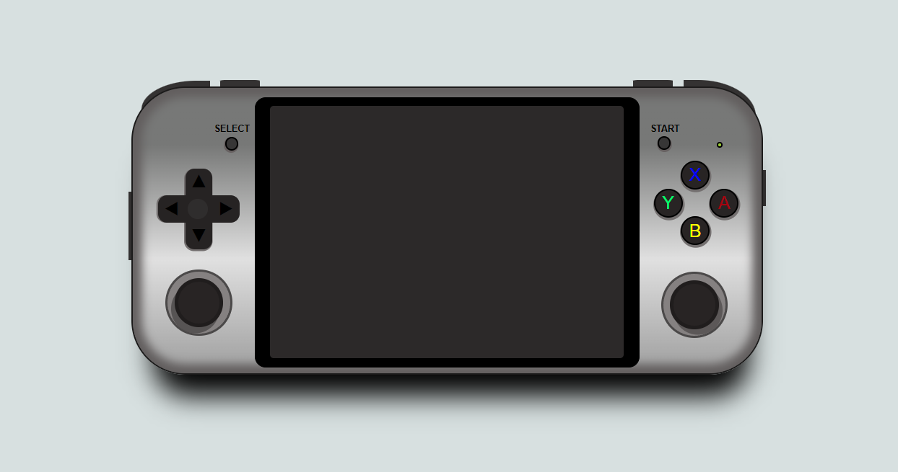
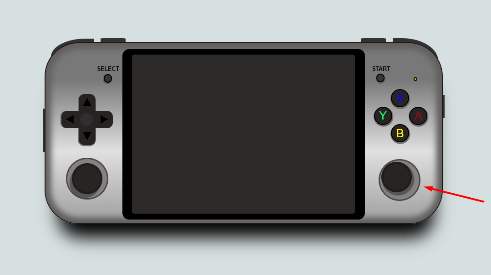

###Proyecto 1 - Videoconsola con CSS

####Consola: 
Anbernic RG552

####Tecnologías utilizadas:

HTML.
CSS.
Javascript (básico).

####Uso:

Se le da efectos de movilidad con CSS a los botones y joysticks.

Para una interacción más dinámica con el usuario se utiliza JavaScript que al presionar el botón START se active y desactive la pantalla con la imagen intro del juego Mobile Leyends.

####Licencia y Copyright:

La consola Anbernic RG552 es propiedad de Shenzhen YangLiMing Electronic Technology Co.

La imagen representada al presionar el botón START es propiedad de Moonton.

#####Autor:

Jorge Luis Martin Lorenzo.